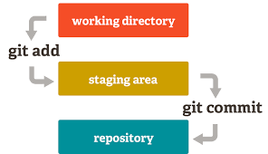

# Git

---

## Git là gì?

Git là một Hệ thống quản trị phiên bản phân tán (Distributed version control system - DVCS). Đây là công cụ giúp các lập trình viên quản lý và theo dõi các thay đổi trong source code hoặc bất kì file nào đó của họ.
Đặc điểm của Git:
+ Hoạt động local trên máy tính cá nhân.
+ Sử dụng command line để giao tiếp với người dùng.
+ Không cung cấp dịch vụ hosting cho các repositories tức không thể truy cập từ bên ngoài máy tính cá nhân.

*Note: Hosting đề cập tới việc cung cấp và duy trì một máy chủ/cơ sở hạ tầng cho phép dữ liệu, website, application, service, ... có thể được truy cập/accessible từ người dùng là user/client thông qua internet.

## Github là gì?

Web-based platform và là service built on top of Git. Cung cấp collaboration hosting (người dùng/máy tính cá nhân có thể trao đổi/lưu trữ repositories với Github) và các tính năng khác tới Git. Github host repositories on the web. You can push your local Git repository to Github to create a remote copy. This enable **collaboration** and **backup**. Github và Git trên máy tính cá nhân kết hợp ăn ý với nhau về giúp lập trình viên quản lý các file trong quá trình làm việc 1 cách hiệu quả.

Tính năng:
+ Giao diện web thân thiện với người dùng khác với command line.
+ Đơn giản hóa việc kết hợp giữa các lập trình viên khi có thể:
  + Nhiều contributor cùng làm việc cùng một lúc trên cùng 1 project.
  + Tạo nhánh.
  + Merge request.
  + Pull request (cần tìm hiểu thêm về tính năng này).
  + Discuss change (cần tìm hiểu thêm về tính năng này) ....

Ngoài Github còn có:
+ Gitlab
+ Bitbucket

## Diagram

Staging area còn được gọi là Index

## Files

Các file trong git repository có thể là 1 trong 2 loại sau đây:
+ Tracked: file mà Git đã biết tới và đã được thêm vào repository.
+ Untracked: file mà nằm trong working directory của bạn nhưng chưa được add vào repository.

## Thuật ngữ

1. Origin: tên mặc định cho remote repository mà bạn clone về
2. Main/Master: nhánh mặc định được tạo ra khi tạo mới 1 repository
3. HEAD: con trỏ đang trỏ tới 1 commit nào đó trong commit history

## Command line

1. **Git clone** Link-to-github-repository
2. **Git add "file name"**, **Git add .** để thêm tất cả các file vào staging area
3. **git log** để xem lịch sử commit, **git log --oneline** để xem lịch sử 1 cách ngắn gọn hơn, nếu lịch sử quá dài thì nhấn enter để xem cách commit cũ hơn
4. **git status** để xem các file untracked, được staged nhưng chưa được commit, ...
5. **git commit -m "commit_message"**, đưa các thay đổi vào phân vùng repository, từ đó tạo lịch sử commit, tạo dấu mốc/milestone
6. **git push**, đẩy nhánh hiện tại lên remote repository, **git push origin main/master** khi được yêu cầu
7. **git pull**, kéo tất cả các thay đổi từ remote repository về local, câu lệnh này nên được sử dụng trước khi commit một cái gì đó để tránh xung đột khi push lên
8. **git branch -a**, xem tất cả các nhánh hiện tạ
9. **git branch "newbranchname"**, tạo nhánh mới
10. **git branch -b "newbranchname"**, tạo nhánh mới và chuyển sang nhánh mới này
11. **git checkout "branchname"**, **git switch "branchname"**, chuyển sang nhánh được chỉnh định
12. **git fetch**, kéo tất cả các thay đổi trên remote về local
13. **git merge**, gộp các thay đổi từ remote vào local, chỉ có tác dụng với nhánh hiện tại, và phải sử dụng **git fetch** trước đó

**Note**:
+ git pull = git fetch + git merge
+ push là chỉ đẩy nhánh hiện tại con trỏ HEAD đang trỏ đến, không đẩy các nhánh khác
+ pull là kéo về hết các thay đổi từ remote, tuy nhiên chỉ tự động merge nhánh hiện tại con trỏ HEAD đang trỏ tới

14. **git checkout #hashcode**, nhảy về commit ứng với #hashcode trong lịch sử, con trỏ HEAD sẽ bây giờ sẽ trỏ tới commit này, sử dụng git log --oneline để tìm #hashcode
15. **git checkout -**, thoát khỏi commit sử dụng #hashcode ở mục 14, con trỏ HEAD trở về với commit trước đó.

? Nếu checkout #hashcode 2 lần liên tiếp thì git checkout - chỉ nhảy về checkout #hashcode lần thứ nhất, vậy làm sao để trở về commit mới nhất?

